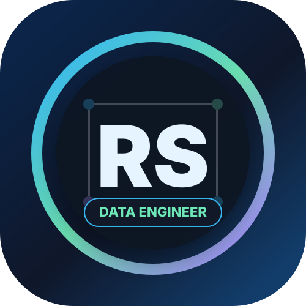

<div align="center">
  
</div>

<br />

<div align="center">
  
</div>

<h1 align="center">Hi, I'm Rohith S 👋</h1>

<h3 align="center">Data Engineer II | Azure | Databricks | PySpark | Delta Lake | Reltio MDM | CI/CD</h3>

<p align="center">
  Building production-style data pipelines with ingestion, data quality, orchestration, retry/recovery, observability, and lakehouse patterns.
</p>

<p align="center">
  
</p>

---

## 👨‍💻 Professional Snapshot

<table>
  <tr>
    <td><b>Current Role</b></td>
    <td>Data Engineer II at Apexon</td>
  </tr>
  <tr>
    <td><b>Client / Project</b></td>
    <td>IQVIA - NextGen MDM</td>
  </tr>
  <tr>
    <td><b>Core Stack</b></td>
    <td>Databricks, PySpark, Azure Data Services, SQL, Delta Lake, Reltio MDM</td>
  </tr>
  <tr>
    <td><b>Engineering Focus</b></td>
    <td>ETL/ELT pipelines, API/file ingestion, data quality, medallion architecture, CI/CD, observability</td>
  </tr>
</table>

I work on Data Engineering solutions involving source ingestion, data quality validation, transformation logic, canonical modeling, and downstream MDM integration. My current focus is strengthening production-grade pipeline design using Databricks, PySpark, Azure, Delta Lake, configuration-driven processing, and CI/CD discipline.

---

## 🚀 What I Build

- End-to-end Data Engineering pipelines using Python, PySpark, SQL, and Databricks
- Bronze, Silver, Gold, Quarantine, and History-layer processing patterns
- API and file ingestion frameworks with schema validation and data quality checks
- Config-driven pipelines with audit tracking, retry handling, and failure recovery
- Delta Lake-style merge, upsert, incremental load, and SCD Type 2 designs
- Observability outputs for pipeline metrics, SLA monitoring, and Power BI-ready reporting

---

## 🛠️ Tech Stack

<p align="center">
  
  
  
  
  
  
  
  
</p>

---

## 📌 Featured Portfolio Project

<div align="center">

### [End-to-End Data Engineering Pipeline Simulator](https://github.com/Rohith-S-98/data-engineering-project)

</div>

A portfolio-ready Data Engineering project designed to simulate real production pipeline patterns.

<table>
  <tr>
    <td><b>Ingestion</b></td>
    <td>API ingestion, database ingestion, raw landing, live API integration planning</td>
  </tr>
  <tr>
    <td><b>Processing</b></td>
    <td>Bronze, Silver, Gold, Quarantine, and SCD Type 2 history layers</td>
  </tr>
  <tr>
    <td><b>Quality</b></td>
    <td>Schema contracts, metadata-driven DQ rules, severity control, quarantine handling</td>
  </tr>
  <tr>
    <td><b>Production Readiness</b></td>
    <td>Audit logs, orchestration, runtime parameters, alerting, retry/recovery, CI/CD gates</td>
  </tr>
  <tr>
    <td><b>Deployment Style</b></td>
    <td>Docker, Databricks Asset Bundle-style structure, Azure Data Factory-style orchestration</td>
  </tr>
  <tr>
    <td><b>Observability</b></td>
    <td>Pipeline metrics mart and Power BI-ready observability dashboard outputs</td>
  </tr>
</table>

---

## 📊 Resume Highlights

- Around 4 years of experience across data engineering, IT systems, ETL, reporting, and analytics support
- Hands-on work with Databricks, PySpark, SQL, Azure Data Services, REST APIs, JSON, CI/CD, and Reltio MDM
- Built and supported scalable ETL/ELT and reporting workflows across multiple business domains
- Experience with Medallion Architecture, configuration-driven pipelines, data quality frameworks, and complex transformations
- Resume impact highlights include improved data reliability, reduced manual effort, and optimized processing/reporting time through automation and pipeline improvements

---

## 🎯 Current Learning Roadmap

```text
Python + SQL foundation
        ↓
PySpark + Databricks engineering
        ↓
Azure Data Engineering + ADF patterns
        ↓
CI/CD + Docker + production readiness
        ↓
Live API integration + observability
        ↓
Interview storytelling + resume-ready project explanation
```

---

## 📈 GitHub Activity

<p align="center">
  
</p>

<p align="center">
  
</p>

---

<h3 align="center">Building one version, one skill, and one production habit at a time.</h3>
