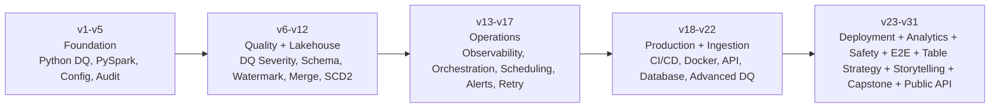

<div align="center">
  
</div>

<br />

<h1 align="center">Rohith S</h1>

<h3 align="center">Data Engineer II | Azure • Databricks • PySpark • Delta Lake • Reltio MDM</h3>

<p align="center">
  <b>I build production-style data pipelines that are validated, monitored, retried, documented, versioned, and explainable.</b>
</p>

<p align="center">
  <a href="https://github.com/Rohith-S-98/data-engineering-project"></a>
  
  
  
</p>

---

## 5-second profile summary

<table>
  <tr>
    <td align="center" width="25%"><b>Current Role</b><br />Data Engineer II<br />Apexon</td>
    <td align="center" width="25%"><b>Client Context</b><br />IQVIA<br />NextGen MDM</td>
    <td align="center" width="25%"><b>Core Stack</b><br />Azure, Databricks<br />PySpark, Delta Lake</td>
    <td align="center" width="25%"><b>Portfolio Proof</b><br />v31 completed<br />end-to-end DE system</td>
  </tr>
</table>

---

## What makes this profile different

<table>
  <tr>
    <td width="33%" align="center">
      <b>Not just scripts</b><br />
      I focus on production habits: validation, audit logs, retry, recovery, SLA signals, CI/CD, release gates, and runtime cleanliness.
    </td>
    <td width="33%" align="center">
      <b>Real-world data flow thinking</b><br />
      I connect source ingestion, data quality, quarantine, canonical modeling, observability, and MDM-style JSON outputs.
    </td>
    <td width="33%" align="center">
      <b>Interview-ready explanation</b><br />
      I can explain source to bronze to silver to gold to MDM with failures, monitoring, recovery, deployment, and business impact.
    </td>
  </tr>
</table>

---

## Featured portfolio system

<div align="center">

### [End-to-End Data Engineering Pipeline Simulator](https://github.com/Rohith-S-98/data-engineering-project)

<b>A production-style Data Engineering portfolio project built as a versioned system, not a one-time demo.</b>


</div>

---

## Final roadmap status

```text
v0.0.0 through v31.0.0: completed and verified
Latest release: v31.0.0 - Live Public API Integration Testing Framework
Final baseline: main / origin/main / v31.0.0
```

### Final validation proof

The main project has been verified with:

```text
172 tests passing
release verification passing
runtime cleanliness passing
GitHub CI passing
mocked CI-safe public API integration passing
manual actual-live public API smoke test passing
```

Manual actual-live V31 smoke test result:

```text
actual_live_users_api: mode=manual-live, raw=10, normalized=10
actual_live_posts_api: mode=manual-live, raw=100, normalized=100
```

---

## End-to-End Portfolio Flow

This project is designed like a real Data Engineering platform: source data enters through API, file, database, or public API-style inputs, passes through validation and quality gates, moves across lakehouse layers, generates downstream MDM-style outputs, and is protected with audit, observability, retry, CI/CD, deployment, and release controls.

```mermaid
flowchart LR
    A[Source Systems<br/>API / File / DB / Public API] --> B[Raw Landing<br/>JSON / CSV / Tables]
    B --> C[Schema Contracts<br/>Required Fields + Types]
    C --> D[Bronze Layer<br/>Standardization]
    D --> E[Data Quality<br/>Rules + Severity]
    E --> F{Valid?}
    F -- Yes --> G[Silver Layer<br/>Clean Data]
    F -- No --> H[Quarantine Layer<br/>Rejected Records]
    G --> I[Gold Layer<br/>Canonical Model]
    I --> J[SCD Type 2<br/>History Tracking]
    J --> K[Reltio-style<br/>JSON Payloads]
    K --> L[Audit + Run Metadata]
    L --> M[Observability Metrics]
    M --> N[Alerts + SLA Monitoring]
    N --> O[Retry / Recovery / Replay]
    O --> P[CI/CD + Release Gates]
    P --> Q[Docker + Databricks / ADF-style Deployment]
    Q --> R[Power BI-ready Outputs]
    R --> S[Secret-safe Environments]
    S --> T[E2E Integration Testing]
    T --> U[Partitioning Strategy]
    U --> V[Capstone + Storytelling]
    V --> W[Public API Integration<br/>Mock CI + Manual Live Test]
```



### What this end-to-end system proves

- I can design pipelines beyond simple ETL scripts.
- I understand source ingestion, validation, transformation, quarantine, canonical modeling, and downstream integration.
- I can implement production-style controls like audit, observability, alerting, retry, release verification, CI/CD gates, and runtime-output cleanliness.
- I can explain the complete flow from source to raw to bronze to silver to gold to MDM-style output.
- I can keep automated CI reliable while separating manual live integration tests from repeatable release gates.

---

## Versioned Project Evolution

This portfolio was built version by version to show how a real pipeline matures from a basic data flow into a production-ready engineering system.



<table>
  <tr>
    <td><b>Version Range</b></td>
    <td><b>Engineering Maturity Added</b></td>
    <td><b>What it proves</b></td>
  </tr>
  <tr>
    <td><b>v1 - v5</b></td>
    <td>Config-driven Python pipeline, PySpark medallion flow, Databricks-style structure, centralized config, audit tracking</td>
    <td>Strong foundation and clean project structure</td>
  </tr>
  <tr>
    <td><b>v6 - v12</b></td>
    <td>Severity-based DQ, custom exceptions, schema validation, incremental load, watermarking, merge/upsert, SCD Type 2</td>
    <td>Data quality, reliability, and lakehouse processing depth</td>
  </tr>
  <tr>
    <td><b>v13 - v17</b></td>
    <td>Observability mart, orchestration, job control, scheduling, dependency checks, alerting, SLA monitoring, retry and replay</td>
    <td>Operational thinking beyond basic transformation code</td>
  </tr>
  <tr>
    <td><b>v18 - v22</b></td>
    <td>CI/CD hardening, Docker runtime, API ingestion, database ingestion, advanced DQ rule catalog</td>
    <td>Production-readiness, testability, and ingestion framework design</td>
  </tr>
  <tr>
    <td><b>v23 - v31</b></td>
    <td>Databricks metadata, ADF simulation, Power BI observability, secret-safe environments, E2E tests, partition strategy, storytelling pack, capstone validation, public API integration testing</td>
    <td>Cloud deployment style, analytics visibility, release discipline, system validation, table-layout planning, interview readiness, and final integration maturity</td>
  </tr>
</table>

---

## Real work alignment

<table>
  <tr>
    <td><b>Apexon / IQVIA-style work</b></td>
    <td><b>How I connect it in my portfolio</b></td>
  </tr>
  <tr>
    <td>API, file, connector, database, and source-system ingestion</td>
    <td>Config-driven API/database ingestion, public API registry, and raw landing</td>
  </tr>
  <tr>
    <td>Landing to staging and business-rule transformations</td>
    <td>Bronze/Silver transformations with schema and DQ checks</td>
  </tr>
  <tr>
    <td>DQ failures, quarantine, and clean data separation</td>
    <td>Severity-based DQ framework and quarantine output path</td>
  </tr>
  <tr>
    <td>Canonical modeling and downstream MDM integration</td>
    <td>Gold canonical layer and Reltio-style JSON payload generation</td>
  </tr>
  <tr>
    <td>Incremental processing, audit tracking, and error triage</td>
    <td>Watermarks, audit logs, retry/recovery, failure replay, SLA monitoring, and release verification</td>
  </tr>
</table>

---

## Tech stack I am actively building with

<p align="center">
  
  
  
  
  
  
  
  
  
  
</p>

<table>
  <tr>
    <td><b>Data Engineering</b></td>
    <td>ETL/ELT, incremental loads, watermarks, SCD Type 2, DQ frameworks, quarantine, observability</td>
  </tr>
  <tr>
    <td><b>Lakehouse</b></td>
    <td>PySpark, Databricks, Delta Lake, Medallion Architecture, canonical modeling</td>
  </tr>
  <tr>
    <td><b>Production Practices</b></td>
    <td>Git/GitHub discipline, CI/CD gates, Docker, release verification, structured documentation, runtime cleanliness</td>
  </tr>
</table>

---

## Current engineering focus

```text
Completed v31 Data Engineering roadmap implementation
        ↓
Strengthen SQL, PySpark, Databricks, Azure, CI/CD, and interview explanation
        ↓
Practice real-work storytelling using Apexon / IQVIA-style MDM data flows
        ↓
Keep improving production-thinking: validation, observability, reliability, and deployment readiness
```

---

## GitHub activity

<p align="center">
  
  
</p>

---

<h3 align="center">Building my Data Engineering career in public — one production habit, one version, and one verified release at a time.</h3>
